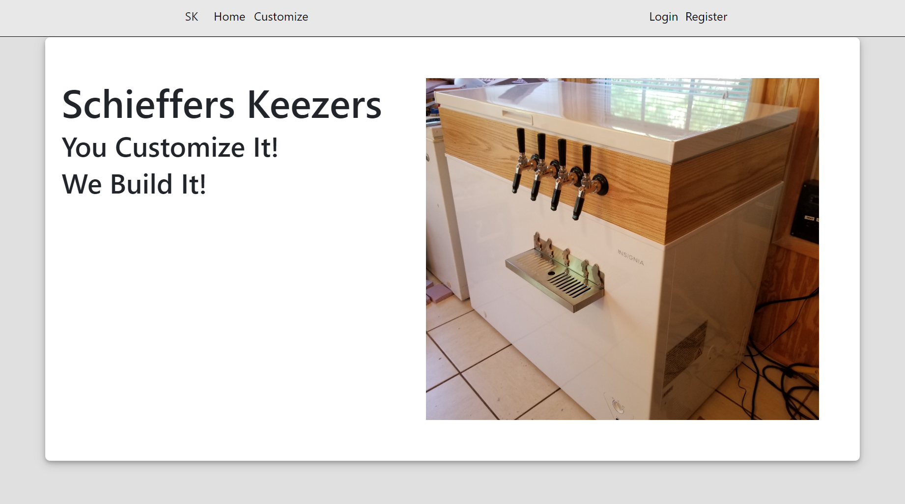

## Schieffers Keezers

Schieffers Keezers is a prototype online ordering web app that allows potential customers to order custom keezers from Schieffers Keezers, LLC. The customize page is broken up into sections for each category of component needed for a full build. Each sections shows all the available components for that category and the user can choose only one. The user can add items to their cart as long as they are logged in. If they don't have an account, they can make one by clicking the register button. As long as they enter a unique email, a password, and their first and last name, they can create an account. The password is salted and hashed using bcrypt and stored in a postgreSQL database. In order to authenticate a user, a jwt token is generated with a secret key, stored in an environment variable on the server, and the users's unique id. The server uses this token to authenticate requests and indicate which user is sending the request. With an account, a user can add items to their cart and view those items by clicking the cart button in the dropdown menu in the top right corner that only appears when a user is logged in. The cart page shows all the items in the users's cart along with the total price, allows them to delete items, and presents a link to the checkout page. The checkout page will show them the items in their cart to confirm which items they are purchasing along with the total and the users' address. If the user doesn't have an address on file, or they are missing a freezer or a tapkit, a warining message is displayed. A freezer and a tapkit are the minimum required components for a keezer build. The user can add or edit their address from the checkout page, or from the account details page. There is also an admin page. The link is only visible if the user logged in has a user_id that matches the value stored on the server. If a user that is not the admin attempts to access the admin page, they are redirected to the home page.

Languages: Javascript, HTML, CSS, SQL

Libraries and Frameworks: React, React Router, Express, PG, jsonWebTokens, Bcrypt, Bootstrap